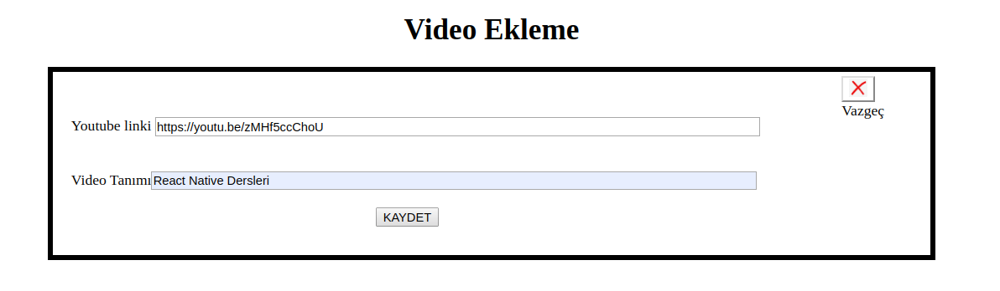
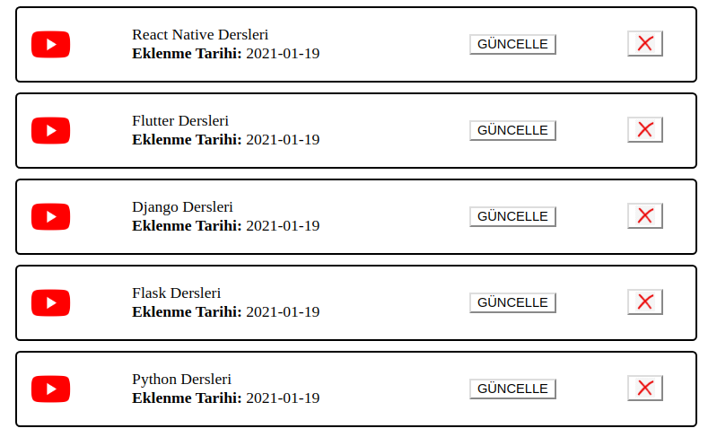
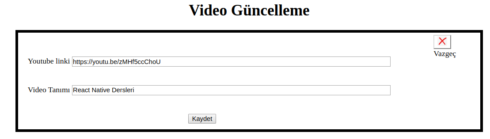

# Contents
* [About](#about)
* [Installation](#installation)
* [Tools and Technologies](#tools-and-technologies)
* [Main Features](#main-features)


# About

This sample video website, built on PHP, is used for to manage basic video panel. It allows you to add,update or delete video.

## Tools and Technologies

* PHP
* Php-Admin
* Mysql

## Installation

```bash
sudo apt install php
```

```bash
cd video-website
```

```bash
php -S localhost:8000 -t src/
```

## Main Features


### Add Video



### View Video List



### Update Video



## License
[GNU 3.0](https://github.com/omeraydemirr/tour-api/blob/c2638bb33e018fab441d078f2a95d4baab905b64/LICENSE)
